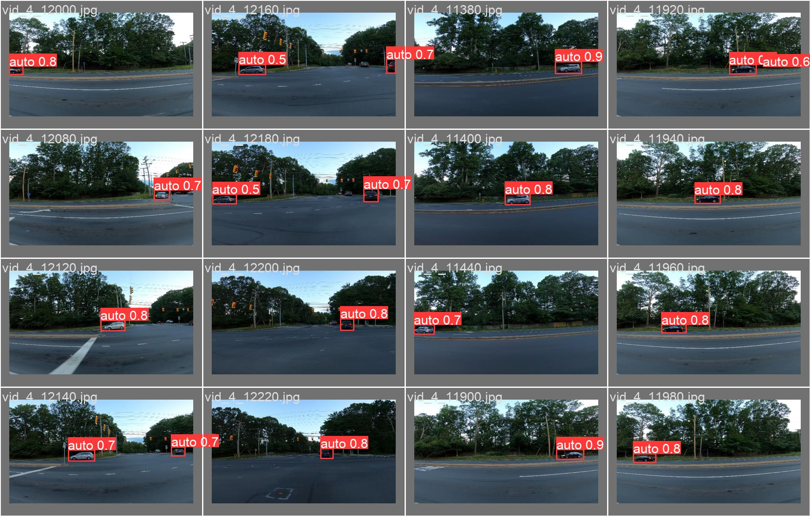

# Проект YOLO для определения автомобилей на изображениях
## Description
Этот проект предназначен для создания модели на основе YOLO (You Only Look Once), которая будет обнаруживать автомобили на изображениях. Результаты обработки изображений сохраняются в виде ограничивающих рамок (bounding boxes).

Веб-сервис, реализованный с использованием FastAPI, включает HTML-страницу с формой загрузки изображений и отображением результатов обработки. Также имеется API, который принимает изображение в виде строки base64 и возвращает маску, наложенную на изображение, а также массив с ограничивающими рамками.

Модель может работать как на CPU, так и на GPU, а конфигурация устройства, IP и порт приложения осуществляется с помощью переменных окружения. Проект упакован в Docker-контейнер для удобства развертывания и использования.
# Performance
| Model         | Precision (P) | Recall (R) | mAP50 | mAP50-95 | weights |
|---------------|---------------|------------|-------|----------|----------|
| YOLOv5s        | 0.89          | 0.944      | 0.96  | 0.758    |14МБ |
| YOLOv5x6        | 0.912    | 0.94 | 0.974 | 0.741 |274МБ |
| YOLOv8x  | 0.775    | 0.934 |  0.896 | 0.659 |133МБ |
| YOLOv7e6e (In work/to future)  | -    | - |  0.697 | 0.573 |295МБ |

# Demonstration

# Installation
## Запуск через Docker (Предпочтительно)

```bash
docker pull ruziy/api
docker run -e HOST=0.0.0.0 -e PORT=8001 -p 8001:8001 ruziy/api
```
upd. HOST=0.0.0.0 зачастую занят браузерами. В моём образе это заглушка (как и PORT), поэтому чтобы получить доступ к API откройте http://localhost:8001/ или http://127.0.0.1:8001/

## Запуск через GitHub
```bash
git clone https://github.com/Ruziy/CompVis_TZ.git
cd CompVis_TZ
pip install -r requirements.txt
cd docker_main
docker build -t <your_project_name> .
docker run -e HOST=0.0.0.0 -e PORT=8001 -p 8001:8001 <your_project_name>
```
